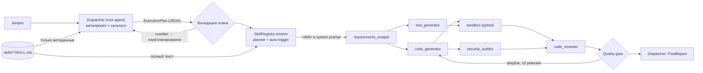

# LLM Harness: диспетчер → скиллы → субагенты

Прототип исполнительного контура (Harness) для домена **Software Engineering**: по запросу на естественном языке harness выдаёт Python-модуль, прошедший спецификацию, независимые тесты в песочнице, аудит безопасности и код-ревью.

## Запуск

```bash
pip install -r requirements.txt
python main.py                          # оба кейса
python main.py --case ratelimit         # один кейс (upload | ratelimit)
python main.py --case upload --no-skills   # абляция: тот же план без инъекции скиллов
python -m pytest                        # 14 тестов харнеса, включая e2e
```

Без ключа используется **offline-модель**: скриптовые ответы вместо LLM. Остальная обвязка работает по-настоящему: валидация плана, выбор и инъекция скиллов, сборка промптов, pytest-песочница, quality gate, ревизии. Ответы offline-модели зависят от внедрённых скиллов и от результата песочницы. Для реальной LLM подходит любой OpenAI-совместимый API (OpenAI, Anthropic, OpenRouter, Ollama); переменные описаны в `.env.example`:

```bash
HARNESS_API_KEY=... HARNESS_MODEL=claude-sonnet-5 HARNESS_BASE_URL=https://api.anthropic.com/v1/ python main.py
```

## Архитектура



| Компонент | Файл | Роль |
|---|---|---|
| Dispatcher | [harness/dispatcher.py](harness/dispatcher.py), [prompts.py](harness/prompts.py) | Метапромпт задаёт границы роли: диспетчер только планирует и делегирует, сам код не пишет. Строит план (шаги, objective, скиллы с обоснованием, маршрутизация входов), управляет gate и ревизиями, формирует итог |
| Субагенты ×5 | [harness/agents.py](harness/agents.py) | Stateless-специалисты. Каждый видит только свою роль, внедрённые скиллы, objective и явно направленные ему входы. Ответ — JSON по Pydantic-схеме из [schemas.py](harness/schemas.py) |
| Skills | [harness/skills.py](harness/skills.py), [skills/](skills/) | Markdown + YAML (`applies_to`, `triggers`, `version`). Диспетчер видит каталог метаданных, субагент получает полный текст (progressive disclosure) |
| Sandbox | [harness/sandbox.py](harness/sandbox.py) | Детерминированный инструмент: запускает тесты test_generator против кода code_generator |
| Трассировка | [harness/tracing.py](harness/tracing.py) | Консольный лог и `runs/<ts>_<case>/`: `trace.jsonl`, `plan.json`, `prompts/*.md` (точные промпты с внедрёнными скиллами), `artifacts/` |

**Как harness удерживает роли и качество.** План проверяется кодом, а не на доверии: существуют ли агенты и скиллы, входит ли агент в `applies_to` скилла, ссылаются ли inputs только на предыдущие шаги. test_generator не может видеть реализацию — он остаётся независимым оракулом. Ревьюер получает отчёты песочницы и аудита. Субагенты перечисляют `applied_skill_rules`, и harness сверяет эти ID с внедрёнными скиллами. Находка HIGH/CRITICAL всегда даёт аудиту FAIL, а при не пройденном gate итоговый статус всегда FAILED — это политика harness, а не мнение модели.

**Скиллы:** `secure-coding` (SEC), `python-clean-code` (PY), `pytest-patterns` (TST), `requirements-engineering` (REQ), `concurrency-safety` (CONC). Скилл подключается двумя путями: его выбирает диспетчер (`planner`) или срабатывает триггер в задаче (`auto-trigger`, например «потокобезопас…» → concurrency-safety).

## Кейсы и лог работы

1. **upload** — `resolve_upload_path` для имён файлов от клиента (CWE-22). Итог: 22 теста зелёные, аудит нашёл LOW/INFO → `DELIVERED_WITH_RISKS`.
2. **ratelimit** — потокобезопасный token bucket. В первой версии кода нет ограничения по capacity. Настоящий тест падает, ревьюер отвечает `REQUEST_CHANGES`, после ревизии 1 все 13 тестов зелёные.

Фрагмент `python main.py --case ratelimit`:

```
▶ s2 DISPATCH → code_generator
    objective: Implement rate_limiter.TokenBucket per spec s1: atomic refill+consume, monotonic injectable clock, ...
    inputs   : s1
    skills   : + python-clean-code v1.0 ~302 tok [planner] selected by dispatcher
               + concurrency-safety v1.0 ~202 tok [auto-trigger] matched "потокобезопас"
    prompt   : system 3675 chars, user 1778 chars
◀ s2 code_generator ✔  rate_limiter.py, 64 lines
    applied skill rules: PY-01, PY-02, PY-03, PY-04, PY-06, PY-07, CONC-01, CONC-02, CONC-03
▶ s4 TOOL → sandbox (pytest, isolated temp dir)
◀ s4 sandbox failed: 12 passed, 1 failed, 0 errors in 1.71s
    FAILED test_rate_limiter.py::test_tokens_never_exceed_capacity_after_long_idle
◀ s6 code_reviewer ✔  verdict REQUEST_CHANGES, 1 issue(s)
QUALITY GATE failed (2 problem(s))
DISPATCHER revision 1: feedback → code_generator, re-running dependent steps s2, s4, s5, s6
▶ s2 DISPATCH → code_generator (revision 1)
    inputs   : s1, previous_attempt, revision_feedback
◀ s4 sandbox passed: 13 passed, 0 failed, 0 errors in 1.53s
◀ s6 code_reviewer ✔  verdict APPROVE, 0 issue(s)
QUALITY GATE passed   →   DELIVERED_WITH_RISKS
```

Что получает субагент (`runs/.../prompts/s2_code_generator.md`):

```
<skills>
<skill name="python-clean-code" version="1.0">
- **PY-04** Inject non-determinism (time, randomness, I/O) through parameters ...
</skill>
<skill name="concurrency-safety" version="1.0"> ... </skill>
</skills>
```

**Влияние скиллов (`--no-skills`):** план тот же, но в upload спецификация сводится к одному критерию, генератор пишет `os.path.join(base_dir, filename)` (path traversal), тестов 2 вместо 22, и уязвимый код проходит gate. Со скиллами тот же кейс даёт allow-list, проверку containment и атакующие payload'ы в тестах.

## Ограничения

- Песочница изолирует только на уровне процесса (временный каталог, отдельный интерпретатор, таймаут, очищенное окружение). Для недоверенного кода в продакшене нужен контейнер или VM.
- Шаги выполняются последовательно, хотя code_generator и test_generator независимы и их можно распараллелить.
- При ревизии тесты не перегенерируются. Если ошибка в самих тестах, harness упрётся в лимит ревизий и вернёт FAILED.
