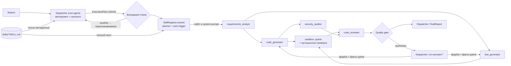

# LLM Harness: диспетчер → скиллы → субагенты

Прототип исполнительного контура для домена **Software Engineering**. Harness получает запрос на естественном языке и выдаёт Python-модуль, который прошёл пять этапов: спецификацию, независимые тесты в песочнице, **проверку самих тестов мутантами**, аудит безопасности и код-ревью. Если gate не пройден, диспетчер решает, кто исправляет: генератор кода или генератор тестов.

## Запуск

```bash
pip install -r requirements.txt
python main.py                             # оба кейса, офлайн-модель (ключ не нужен)
python main.py --case upload --no-skills   # абляция: тот же план без инъекции скиллов
python -m pytest                           # тесты харнеса, включая e2e
```

Без ключа ответы модели заменяет **офлайн-модель** со скриптовыми ответами. Всё остальное работает по-настоящему: валидация плана, инъекция скиллов, песочница, мутационная проверка, gate, маршрутизация ревизий. Для реальной LLM подходит любой OpenAI-совместимый API: скопируй `.env.example` в `.env` и заполни `HARNESS_API_KEY`, `HARNESS_MODEL`, `HARNESS_BASE_URL` (для self-hosted с самоподписанным сертификатом ещё `HARNESS_SSL_VERIFY=false`).

```bash
python main.py --case ratelimit --model qwen-nothink
python scripts/ablation.py --models qwen-nothink --repeat 2   # абляция скиллов на реальной LLM
```

## Архитектура



| Компонент | Файл | Роль |
|---|---|---|
| Dispatcher | [dispatcher.py](harness/dispatcher.py), [prompts.py](harness/prompts.py) | Метапромпт ограничивает роль: диспетчер планирует, маршрутизирует ревизии и подводит итог, но сам код не пишет. Независимые шаги плана выполняются параллельно, волнами по DAG |
| Субагенты ×5 | [agents.py](harness/agents.py), [schemas.py](harness/schemas.py) | Stateless-специалисты. Каждый видит только свою роль, внедрённые скиллы, objective и явно направленные ему входы. Ответ — JSON по Pydantic-схеме |
| Skills | [skills.py](harness/skills.py), [skills/](skills/) | Markdown + YAML (`applies_to`, `triggers`, `version`). Диспетчер видит только каталог метаданных, субагент получает полный текст |
| Sandbox + мутации | [sandbox.py](harness/sandbox.py), [mutation.py](harness/mutation.py) | Прогоняет тесты test_generator против кода, затем против мутантов этого кода (снятая блокировка, убранный min/max, off-by-one, пропущенный raise) |
| Трассировка | [tracing.py](harness/tracing.py) | Консоль и `runs/<ts>_<case>/`: `trace.jsonl`, `plan.json`, `prompts/*.md` (точные промпты с внедрёнными скиллами), `artifacts/` |

**Роли и качество держит код, а не доверие к модели.**
- План проверяется кодом: существуют ли агенты и скиллы, входит ли агент в `applies_to` скилла, ссылаются ли входы только на предыдущие шаги, не видит ли test_generator реализацию.
- Зелёные тесты ещё ничего не доказывают, поэтому harness проверяет и сам оракул мутантами. Выживший `DropLock` (тесты не заметили, что блокировки убраны) или mutation score ниже 0.6 валят gate.
- При проваленном gate **диспетчер решает, кто виноват**: код, тесты или оба. Harness добавляет к фидбэку сырые строки падений pytest, без исходника реализации. Перезапускаются только зависимые шаги.
- Находка HIGH/CRITICAL всегда даёт аудиту FAIL, а при проваленном gate итог всегда FAILED. Это политика harness, а не мнение модели. Невалидный ответ модели на ревизии не роняет прогон: сохраняется предыдущая версия, сырой ответ пишется в папку прогона.

**Скиллы:** `secure-coding` (SEC), `python-clean-code` (PY), `pytest-patterns` (TST), `requirements-engineering` (REQ), `concurrency-safety` (CONC). Скилл подключается двумя путями: его выбирает диспетчер (`planner`) или срабатывает триггер в задаче (`auto-trigger`, например «потокобезопас…» → concurrency-safety). Субагенты перечисляют `applied_skill_rules`, harness сверяет эти ID с внедрёнными скиллами.

## Лог работы

Реальный прогон `python main.py --case ratelimit` на `qwen-nothink`, с сокращениями:

```
  ! plan rejected: - step s5 (security_auditor): skill 'concurrency-safety' does not apply to this agent
DISPATCHER plan accepted: 5 steps
  s1  code_generator    skills: concurrency-safety, python-clean-code, secure-coding   in: request
  s2  test_generator    skills: pytest-patterns, concurrency-safety, secure-coding     in: request
  ...
▶ s2 DISPATCH → test_generator                                  (s1 и s2 идут параллельно)
    skills   : + pytest-patterns v1.3 ~431 tok [planner] selected by dispatcher
               + concurrency-safety v1.2 ~594 tok [planner] selected by dispatcher
◀ s2 test_generator ✔ 58.27s  test_token_bucket.py, 24 test functions
    applied skill rules: TST-01, ..., TST-09, CONC-05, CONC-06
◀ s3 sandbox failed: 51 passed, 2 failed
    FAILED test_token_bucket.py::test_zero_tokens_raises_value_error
QUALITY GATE failed (3 problem(s))
DISPATCHER revision 1: feedback → test_generator, re-running dependent steps s2, s3, s5
    rationale: The implementation is correct and matches the spec: ... tokens=0 is valid and always succeeds ...
▶ s2 DISPATCH → test_generator (revision 1)
    inputs   : request, previous_attempt, revision_feedback
...
DISPATCHER revision 2: feedback → test_generator, re-running dependent steps s2, s3, s5
    rationale: The implementation correctly accepts a float capacity (1.5) as per the spec ...
◀ s3 sandbox passed: 53 passed, 0 failed; 8/12 mutants killed (0.67)
    survived DropRaise (line 67): `raise TypeError('clock must be callable')` -> `pass`
◀ s5 code_reviewer ✔  verdict APPROVE, 0 blocking issue(s), 3 suggestion(s)
QUALITY GATE passed   →   DELIVERED_WITH_RISKS  (рекомендации ревьюера и LOW/INFO ушли в residual risks)
```

Здесь видно всё, что делает harness. Валидатор отклонил скилл, назначенный агенту вне его `applies_to`. Генераторы кода и тестов работали параллельно. Диспетчер дважды разобрался, что упали тесты, противоречащие спецификации, а не код, и отправил ревизию test_generator, не трогая реализацию. Тест на конкурентность, написанный по шаблону из скилла, поймал снятую блокировку: мутант `DropLock` не выжил. Точные промпты с внедрёнными скиллами лежат в `runs/<ts>_ratelimit/prompts/*.md`, например `<skill name="concurrency-safety" version="1.2"> ... **CONC-06** ...</skill>` в system prompt test_generator.

Офлайн-режим (`python main.py`) воспроизводит обе ветки ревизий детерминированно. В upload мутационная проверка 3/6 роняет gate, диспетчер отправляет ревизию test_generator, после неё 4/6. В ratelimit падает тест на ёмкость, и ревизию получает code_generator.

## Влияние скиллов (абляция)

`python scripts/ablation.py --models qwen-nothink --repeat 2`: 8 прогонов на реальной LLM. Кроме вердикта harness, итоговый код проверяет **независимая проба** ([probes.py](scripts/probes.py)), которую не видит ни один агент. Для upload это 10 атакующих имён: сколько путей вышли за пределы каталога. Для ratelimit — 8 потоков × 200 вызовов, 10 повторов: сколько раз лимитер выдал больше ёмкости.

| Кейс | Скиллы | Статус (ревизий) | Тестов | Mutation score | Проба: сбоев | `capacity=inf` (SEC-05) |
|---|---|---|---|---|---|---|
| ratelimit | да | ошибка¹; DELIVERED_WITH_RISKS (2) | 17 | 0.92 | 0/10 | отклоняется |
| ratelimit | нет | DELIVERED_WITH_RISKS (1); DELIVERED_WITH_RISKS (0) | 29; 24 | 0.75; 1.00 | 0/10; 0/10 | принимается (лимит выключен) |
| upload | да | FAILED (3); DELIVERED_WITH_RISKS (2) | 19; 17 | –; 0.67 | 0/10; 0/10 | – |
| upload | нет | DELIVERED_WITH_RISKS (0); FAILED (3) | 9; 30 | 0.86; – | 0/10; 0/10 | – |

¹ Невалидный JSON на первом шаге после трёх попыток исправления. Откатиться было не к чему, и прогон остановился.

**Выводы.**
- На `qwen-nothink` финальный код корректен во всех прогонах, со скиллами и без (пробы: 0 сбоев). Эти два кейса модель знает хорошо, так что по корректности скиллы разницы не дают.
- Разница видна на правилах, которые задают скиллы. Без `secure-coding` лимитер принимает `capacity=inf`, то есть лимит фактически выключен; со скиллом такая конфигурация отклоняется. Со скиллом `concurrency-safety` тест на конкурентность повторяет шаблон дословно и ловит снятую блокировку.
- У скиллов есть цена: более строгие спецификации и тесты чаще расходятся друг с другом. Прогоны со скиллами в среднем требуют больше ревизий. Оба FAILED случились потому, что тесты и спецификация не сошлись за 3 ревизии, а не из-за уязвимого кода.
- Выборка маленькая (2 прогона на ячейку), это тенденция, а не статистика. Детерминированно влияние скиллов показывает офлайн-абляция (`python main.py --case upload --no-skills`). Там без скиллов спецификация сводится к одному критерию, а генератор пишет `os.path.join(base_dir, filename)` (path traversal).

## Ограничения

- Песочница изолирует только на уровне процесса (временный каталог, отдельный интерпретатор, таймаут, очищенное окружение). Для недоверенного кода в продакшене нужен контейнер или VM.
- Мутационная проверка оценивает тесты только там, где в коде есть что мутировать. Если в коде нет блокировки, отсутствие потокобезопасности она не заметит. Эквивалентные мутанты (слои защиты в глубину) неизбежно выживают, поэтому порог 0.6, а не 1.0. Мутант `DropLock` вставляет `time.sleep(0)` в бывшую критическую секцию: под GIL проверка-и-действие без вызовов между ними случайно атомарна, и без такой вставки снятую блокировку не заметил бы ни один тест.
- Если модель не выдаёт валидный JSON на первом выполнении шага, прогон останавливается: откатываться не к чему. При ревизии сохраняется предыдущая версия. Некоторые self-hosted серверы молча обрезают ответ на 4096 токенах, поэтому нужен `HARNESS_MAX_TOKENS=16000`.
- Реальная LLM не детерминирована, а gate строгий, поэтому часть прогонов заканчивается `FAILED`: тесты и код не сходятся за 3 ревизии. Для прототипа это честный исход, harness не выдаёт непроверенный код за готовый.
